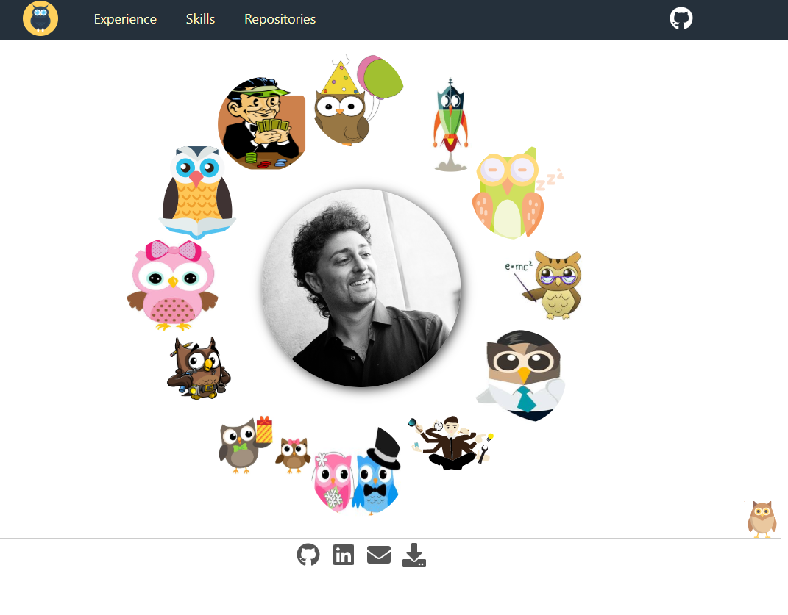
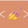

# Portfolio

=======

  

<h1 align="center">
  Francesco Vittori
</h1>

This project is aimed to show my skills and experience.

## 📷 Preview

## 🚀 Tech Stack
 Gatsby

 React

 Styled components

Animations are pure CSS

